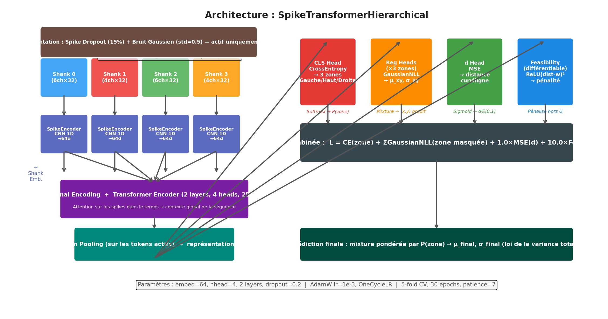

<div align="center">
  
  &nbsp;&nbsp;&nbsp;&nbsp;&nbsp;
  
  <br/><br/>

  # Spike Transformer — Neural Position Decoding
  **Theta Gang · ICM Hackathon 2026**

  
  
  
</div>

---

## Problem

Decode the **2D position** of a mouse navigating a U-shaped maze from short windows (108 ms) of multi-shank extracellular spike recordings. The model must also output **calibrated uncertainty** and keep predictions inside the maze corridor.

| | Baseline (k-NN + PCA-80) | Spike Transformer |
|---|---|---|
| Median Euclidean error | 0.337 | **0.118** |
| Zone classification | — | 90.2% |
| Predictions inside corridor | — | 97.8% |

---

## Architecture

<div align="center">
  
</div>

The model uses a hierarchical approach combining zone classification with conditional position regression:

1. **Per-shank 1-D CNN** — each spike waveform (32 samples × up to 6 channels) is encoded into a 64-dim embedding by a shank-specific CNN
2. **Transformer encoder** (2 layers, 4 heads) — attends across all spikes in the window, learning cross-shank interactions
3. **Zone classifier** (3-way softmax) — Left / Top / Right arm of the U-maze
4. **3 conditional regression heads** — each predicts (μ, σ) for position within its zone
5. **Curvilinear distance head** — predicts `d ∈ [0, 1]` along the maze skeleton

At inference, the final position is a **zone-probability-weighted Gaussian mixture** (law of total expectation / variance), producing both a point estimate and calibrated uncertainty.

---

## Key Techniques

**Feasibility loss** — a custom loss penalises predictions that fall outside the corridor:

$$\mathcal{L}_{\text{feas}} = \mathbb{E}\left[\max(0,\ d_{\text{skeleton}} - w)^2\right]$$

weighted at λ = 10, strongly constraining predictions to the maze geometry.

**Data augmentation** — spike dropout (p = 0.15) randomly masks individual spikes; Gaussian waveform noise (σ = 0.5) adds robustness to waveform shape variation.

**Ensemble & uncertainty** — 5-fold cross-validation trains 5 independent models. Uncertainty decomposes into aleatoric and epistemic components:

$$\sigma^2_{\text{total}} = \underbrace{\mathbb{E}[\sigma^2_k]}_{\text{aleatoric}} + \underbrace{\text{Var}[\mu_k]}_{\text{epistemic}}$$

---

## Repository Structure

```
spike-transformer/
├── src/                    # Python package
│   ├── config.py           #   Hyperparameters and paths
│   ├── dataset.py          #   PyTorch Dataset and data loading
│   ├── model.py            #   SpikeTransformerHierarchical
│   ├── geometry.py         #   U-maze skeleton and curvilinear distance
│   ├── losses.py           #   FeasibilityLoss
│   └── trainer.py          #   Training and evaluation loops
├── scripts/
│   ├── train.py            #   5-fold cross-validation training
│   ├── evaluate.py         #   Ensemble evaluation + all figures
│   └── visualize_data.py   #   Exploratory data analysis
├── notebooks/
│   ├── 02i_transformer_combined.ipynb   # Main development notebook
│   ├── analysis/           #   7 feature analysis scripts + log
│   └── pipeline_*.ipynb    #   Earlier pipeline iterations
├── figures/
│   ├── reference/          #   Architecture and method diagrams
│   ├── data/               #   EDA outputs
│   ├── training/           #   Loss curves, LR schedules
│   └── evaluation/         #   Scatter plots, heatmaps, calibration
├── artifacts/              # Pre-computed maze masks and distance maps
├── pres/                   # Presentation website (GitHub Pages)
├── checkpoints/            # Trained model weights (gitignored)
├── outputs/                # Prediction arrays (gitignored)
├── data/                   # Raw data files (gitignored)
├── requirements.txt
└── pyproject.toml
```

---

## Quick Start

```bash
# Install dependencies
pip install -r requirements.txt

# Place data files in data/
#   M1199_PAG_stride4_win108_test.parquet
#   M1199_PAG.json

# Exploratory data analysis
python scripts/visualize_data.py       # → figures/data/

# Train (5-fold cross-validation)
python scripts/train.py                # → checkpoints/

# Evaluate ensemble
python scripts/evaluate.py             # → figures/evaluation/ + outputs/
```

---

## Team

| | Name |
|---|---|
|  | **Clement** |
|  | **Sacha** |
|  | **Romaric** |
|  | **Gregoire** |
|  | **Octave** |

---

<div align="center">
  <sub>Theta Gang · Institut du Cerveau (ICM) · 2026</sub>
</div>
