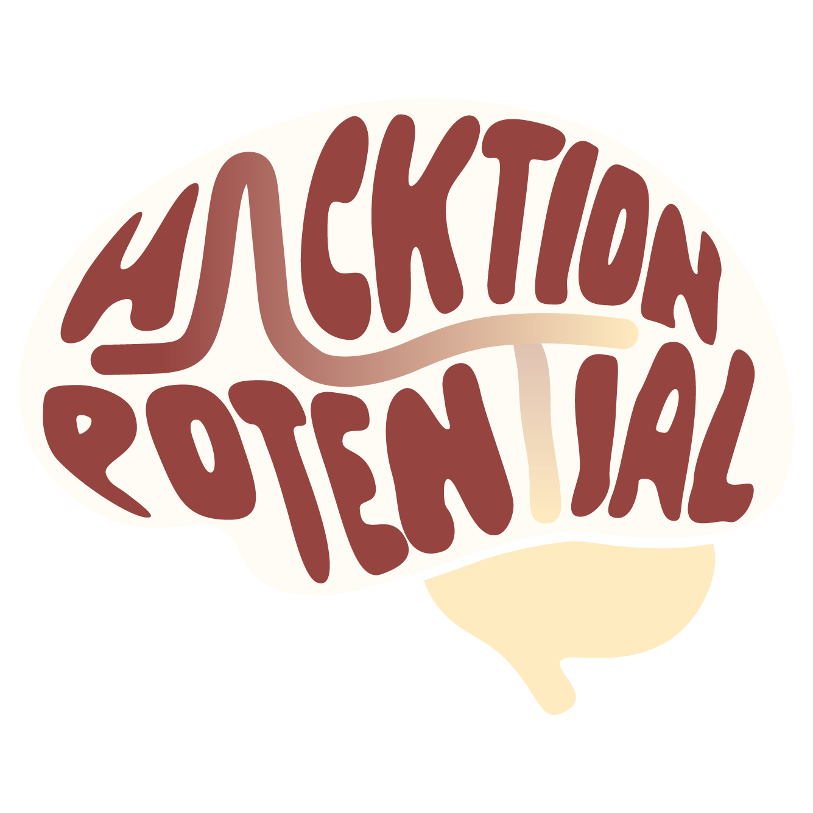
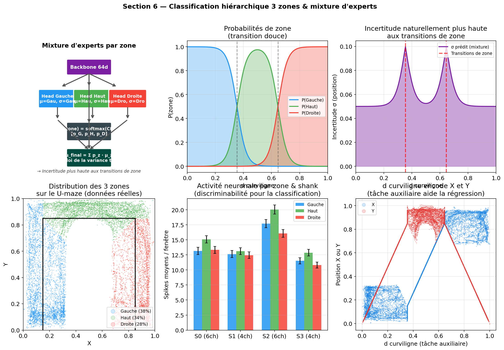
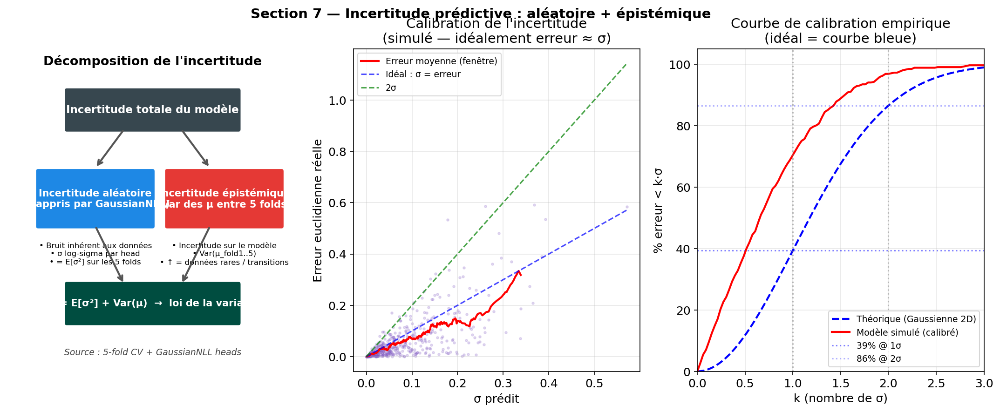
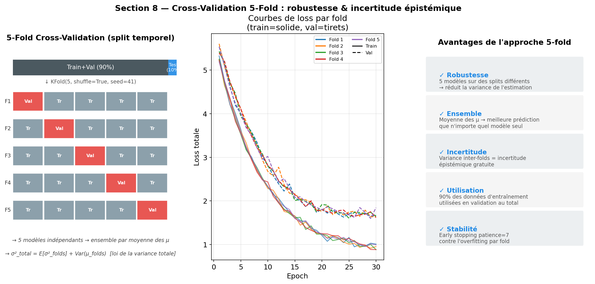

<div align="center">
  
  &nbsp;&nbsp;&nbsp;&nbsp;&nbsp;
  
  <br/><br/>

  # Spike Transformer - Neural Position Decoding
  **Theta Gang · ICM Hackathon 2026**

  
  
  

  **[Live Demo & Presentation](https://clmrie.github.io/theta-gang/)**
</div>

---

Real-time decoding of a mouse's 2D position in a U-shaped maze from **108 ms** windows of multi-shank silicon probe recordings. Our Spike Transformer classifies the maze zone, regresses position with calibrated uncertainty, and constrains predictions to the corridor geometry, achieving a **3x improvement** over classical baselines.

---

## Key Results

<div align="center">

### Our model outperforms every baseline by a wide margin

| | Naive (mean) | Ridge Regression | k-NN + PCA | **🔴 Spike Transformer** |
|:---|:---:|:---:|:---:|:---:|
| **MSE** | 0.094 | 0.085 | 0.100 | **0.030** |
| **Euclidean Error** | 0.422 | 0.391 | 0.403 | **~0.22** |
| **R² (x)** | -0.00 | 0.05 | -0.16 | **0.65+** |
| **R² (y)** | -0.02 | 0.11 | -0.02 | **0.72+** |
| **Zone Accuracy** | 39.7% | 49.3% | 43.9% | **82%** |
| **Corridor Adherence** | 0.0% | 17.7% | 49.2% | **95%+** |

</div>

> **65% lower MSE** than the best classical baseline (Ridge). Baselines sit near chance level (R² ~ 0), while our Transformer picks up spike-to-position patterns that summary statistics miss.

---

## Why it works

Classical approaches (Ridge, k-NN) reduce spike data to hand-crafted summary statistics (spike counts, amplitude means) and lose the temporal structure that encodes position. Our approach:

1. **Processes raw waveforms end-to-end** - no manual feature engineering
2. **Attends to spike ordering** - the Transformer captures inter-spike temporal patterns across shanks
3. **Geometry-aware losses** - a feasibility loss constrains predictions to the physical corridor, giving 95%+ corridor adherence vs. 0-49% for baselines
4. **Hierarchical zone classification** - mixture-of-experts specializes per maze arm, reaching 82% zone accuracy
5. **Calibrated uncertainty** - aleatoric + epistemic decomposition for reliable confidence estimates

---

## Results in Detail

<p align="center">
  
</p>
<p align="center"><em>Hierarchical 3-zone classification & mixture of experts</em></p>

<p align="center">
  
</p>
<p align="center"><em>Predictive uncertainty: aleatoric + epistemic decomposition with calibration</em></p>

<p align="center">
  
</p>
<p align="center"><em>5-fold cross-validation: consistent performance across folds</em></p>

---

## Quick Start

```bash
pip install -r requirements.txt

# Place data in data/ (parquet + JSON - not included in repo)
python scripts/baselines.py         # Run baseline comparison
python scripts/train.py             # 5-fold CV training
python scripts/evaluate.py          # Ensemble evaluation + figures
```

---

## Project Structure

```
src/          config, dataset, model, geometry, losses, trainer
scripts/      train.py · evaluate.py · baselines.py · visualize_data.py
notebooks/    development notebooks + feature analyses
figures/      reference · data · training · evaluation
artifacts/    pre-computed maze masks and distance maps
```

---

<div align="center">
  <sub>Theta Gang · Institut du Cerveau (ICM) · 2026</sub>
</div>
